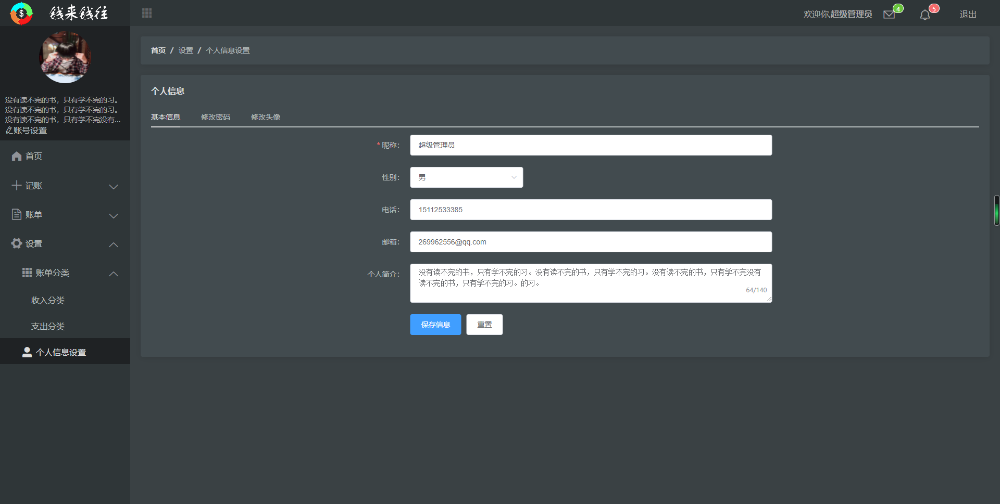
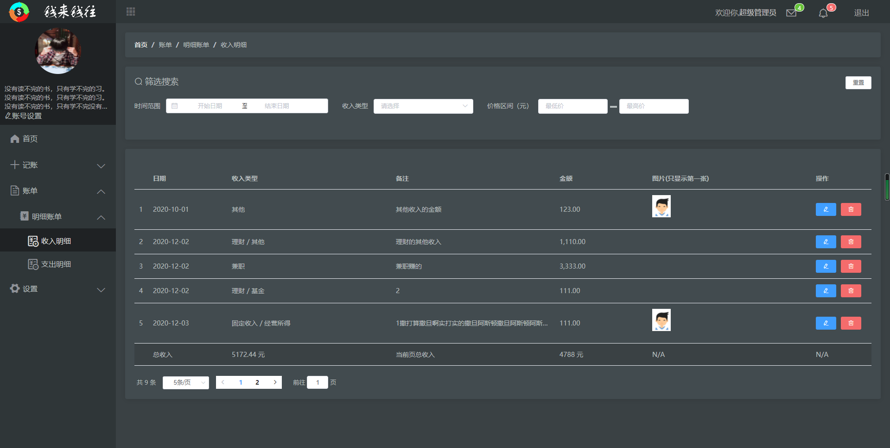
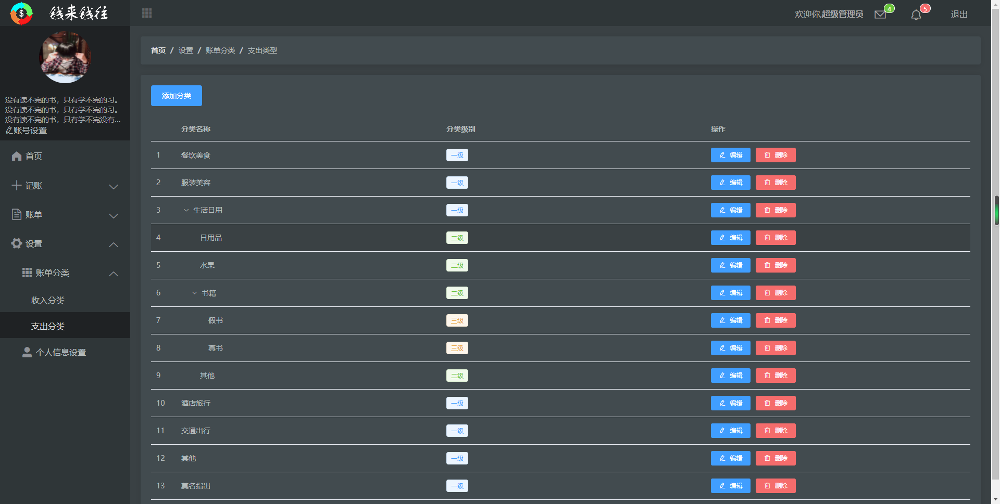
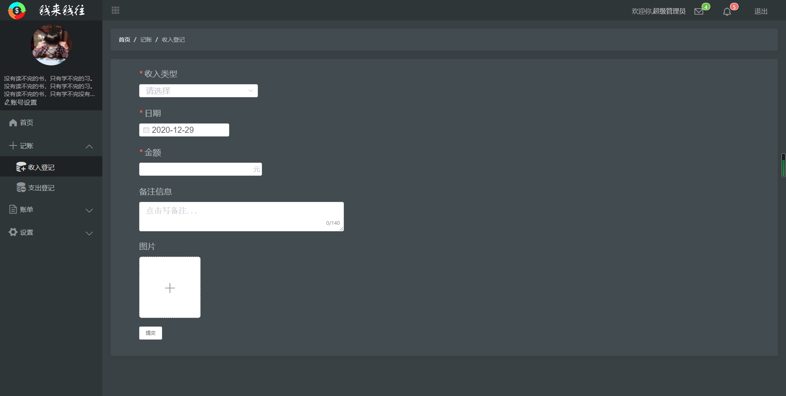

## 前言
这是一个可以帮助用户记账的网站

## 前端
该项目为前后端分离的项目，后端代码在 `server` 文件中

### 项目布局
```
src -- 源码目录
├── assets -- 静态图片资源文件
├── components -- 通用组件封装
├── router -- vue-router路由配置
├── store -- vuex的状态管理
└── views -- 前端页面
    ├── Index -- 首页
    ├── SignIn -- 登录注册
```

### 项目效果图








## 服务器（server文件夹下）
使用Node.js和express框架

### config文件夹
存放数据库配置项

### router文件夹
控制路由

### untils工具层

- dbConfig.js
	+ 封装了对数据库的连接操作


### dao文件夹
封装对 数据库 的操作

- baseDao.js
	- 封装了对数据库整体的一个操作