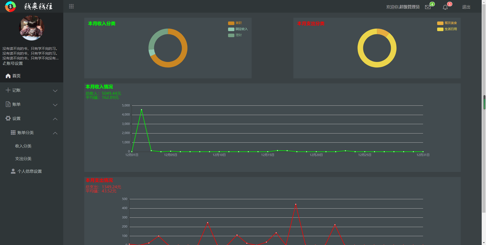

## 前言
这是一个可以帮助用户记账的网站

## 前端
该项目为前后端分离的项目，为了方便，把前后端代码放在一个仓库下，后端代码在 `server` 文件中


## 项目运行
1. 首先确定电脑已安装 Node.js
2. 在根目录下使用 `npm i` 下载相关包
3. 进入 server 目录，在该目录下同样运行 `npm i` 下载后端相关包
4. 在 server 目录下，在终端中运行 `node ./app.js`
5. 在 根目录下，在终端中运行 `npm run serve`
6. 在弹出的提示下，进入对应的网址，一般是 `http://localhost:8080/`
- 注意：如遇前端点击没反应，有可能是后端代码阻塞，请停止运行 server 下的终端，并重新开启即可。


### 项目布局
```
server 后端代码存放地
public 静态文件
src -- 源码目录
├── assets -- 静态图片资源文件
├── components -- 通用组件封装
├── router -- vue-router路由配置
├── store -- vuex的状态管理
└── views -- 前端页面
    ├── Index -- 首页
    ├── SignIn -- 登录注册
```

### 项目效果图





## 服务器（server文件夹下）
使用Node.js和express框架

### config文件夹
存放数据库配置项

### router文件夹
控制路由

### untils工具层

- dbConfig.js
	+ 封装了对数据库的连接操作


### dao文件夹
封装对 数据库 的操作

- baseDao.js
	- 封装了对数据库整体的一个操作
